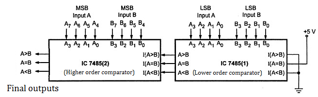

#### Introduction:

The outcome of comparison between two numbers takes any of the three possibilities:
Either both the numbers A & B are equal (A = B), or number A is greater than number B (A &gt; B) or number A is smaller than number B (A &lt; B).
Any byte consists of two nibbles (lower nibble and the upper nibble) i.e. 8 bits. To compare two – 8 bit numbers, the concept used is to compare the most significant bits (MSB’s) of the two numbers and proceed with the next bit.

#### IC 7485 Based 8 bit Comparator:
IC 7485 is a 4-bit comparator with two – 4 bit inputs and three cascade inputs and three compare outputs, A < B, A = B and A > B. The cascade inputs enable cascading of multiple ICs 7485 to obtain N- magnitude comparator (N is an integer). To compare two 8-bit numbers two such ICs are required. IC 7485 can be expanded to compare more than 4 bit numbers. An 8-bit comparator compares the two 8-bit numbers by cascading of two 4-bit comparator ICs 7485. 

#### Connection Diagram:
<ol>
<li>
For the lower order comparator IC 7485 (1), the A=B cascade input must be connected to Logic 1 (Vcc), while the other two cascade inputs must be connected to Logic 0 (ground).
</li>
<li>
The lower order comparator outputs, A < B, A = B and A > B are connected to the respective cascade inputs of the higher order comparator IC 7485(2).
</li>
<li>
The outputs of the higher order comparator become the final outputs of this eight-bit comparator.
</li>
Fig.1 shows the connection diagram for 8 bit comparator using multiple 7485 ICs.
</ol>

 

Fig 1. Eight bit Magnitude Comparator

<b> Note: </b> 
<b>8 bit Input A:</b>  A7 &nbsp; A6 &nbsp; A5 &nbsp; A4 &nbsp; A3 &nbsp; A2 &nbsp; A1 &nbsp; A0  
<b>8 bit Input B:</b> B7 &nbsp; B6 &nbsp; B5 &nbsp; B4 &nbsp; B3 &nbsp; B2 &nbsp; B1 &nbsp; B0  
Where A7 & B7 are the MSBs of binary numbers A & B respectively. 

The Comparator compare the number bit by bit from MSB to LSB.

The function table of 8-bit comparator is:
<table>
 <tr>
  <th colspan=8>Comparing Input</th>
  <th colspan=3>Output</th>
 </tr>
 <tr>
  <th>A7,B7 </th>
  <th>A6,B6</th>
  <th>A5,B5</th>
  <th>A4,B4</th>
  <th>A3,B3 </th>
  <th>A2,B2</th>
  <th>A1,B1</th>
  <th>A0,B0</th>
  <th>A &gt; B</th>
  <th>A = B</th>
  <th>A &lt; B</th>
 </tr>
 <tr>
  <td>A7  &gt; B7</td>
  <td>X</td>
  <td>X</td>
  <td>X</td>
  <td>X</td>
  <td>X</td>
  <td>X</td>
  <td>X</td>
  <td>1</td>
  <td>0</td>
  <td>0</td>
 </tr>
 <tr>
  <td>A7&lt; B7</td>
  <td>X</td>
  <td>X</td>
  <td>X</td>
  <td>X</td>
  <td>X</td>
  <td>X</td>
  <td>X</td>
  <td>0</td>
  <td>0</td>
  <td>1</td>
 </tr>
 <tr>
  <td>A3 = B7</td>
  <td>A6&gt; B6</td>
  <td>X</td>
  <td>X</td>
  <td>X</td>
  <td>X</td>
  <td>X</td>
  <td>X</td>
  <td>1</td>
  <td>0</td>
  <td>0</td>
 </tr>
 <tr>
  <td>A7= B7</td>
  <td>A6&lt; B6</td>
  <td>X</td>
  <td>X</td>
  <td>X</td>
  <td>X</td>
  <td>X</td>
  <td>X</td>
  <td>0</td>
  <td>0</td>
  <td>1</td>
 </tr>
 <tr>
  <td>A7= B7</td>
  <td>A6= B6</td>
  <td>A5&gt; B5</td>
  <td>X</td>
  <td>X</td>
  <td>X</td>
  <td>X</td>
  <td>X</td>
  <td>1</td>
  <td>0</td>
  <td>0</td>
 </tr>
 <tr>
  <td>A7= B7</td>
  <td>A6= B6</td>
  <td>A5&lt; B5</td>
  <td>X</td>
  <td>X</td>
  <td>X</td>
  <td>X</td>
  <td>X</td>
  <td>0</td>
  <td>0</td>
  <td>1</td>
 </tr>
 <tr>
  <td>A7= B7</td>
  <td>A6= B2</td>
  <td>A5= B5</td>
  <td>A4&gt; B4</td>
  <td>X</td>
  <td>X</td>
  <td>X</td>
  <td>X</td>
  <td>1</td>
  <td>0</td>
  <td>0</td>
 </tr>
 <tr>
  <td>A7= B7</td>
  <td>A6= B6</td>
  <td>A5= B5</td>
  <td>A4&lt; B4</td>
  <td>X</td>
  <td>X</td>
  <td>X</td>
  <td>X</td>
  <td>0</td>
  <td>0</td>
  <td>1</td>
 </tr>
 <tr>
  <td>A7= B7</td>
  <td>A6= B6</td>
  <td>A5= B5</td>
  <td>A4= B4</td>
  <td>A3&gt; B3</td>
  <td>X</td>
  <td>X</td>
  <td>X</td>
  <td>1</td>
  <td>0</td>
  <td>0</td>
 </tr>
 <tr>
  <td>A7= B7</td>
  <td>A6= B6</td>
  <td>A5= B5</td>
  <td>A4= B4</td>
  <td>A3&lt; B3</td>
  <td>X</td>
  <td>X</td>
  <td>X</td>
  <td>0</td>
  <td>0</td>
  <td>1</td>
 </tr>
 <tr>
  <td>A7= B7</td>
  <td>A6= B6</td>
  <td>A5= B5</td>
  <td>A4= B4</td>
  <td>A3= B3</td>
  <td>A2&gt; B2</td>
  <td>X</td>
  <td>X</td>
  <td>1</td>
  <td>0</td>
  <td>0</td>
 </tr>
 <tr>
  <td>A7= B7</td>
  <td>A6= B6</td>
  <td>A5= B5</td>
  <td>A4= B4</td>
  <td>A3= B3</td>
  <td>A2&lt; B2</td>
  <td>X</td>
  <td>X</td>
  <td>0</td>
  <td>0</td>
  <td>1</td>
 </tr>
 <tr>
  <td>A7= B7</td>
  <td>A6= B6</td>
  <td>A5= B5</td>
  <td>A4= B4</td>
  <td>A3= B3</td>
  <td>A2= B2</td>
  <td>A1&gt; B1</td>
  <td>X</td>
  <td>1</td>
  <td>0</td>
  <td>0</td>
 </tr>
 <tr>
  <td>A7= B7</td>
  <td>A6= B6</td>
  <td>A5= B5</td>
  <td>A4= B4</td>
  <td>A3= B3</td>
  <td>A2= B2</td>
  <td>A1&lt; B1</td>
  <td>X</td>
  <td>0</td>
  <td>0</td>
  <td>1</td>
 </tr>
 <tr>
  <td>A7= B7</td>
  <td>A6= B6</td>
  <td>A5= B5</td>
  <td>A4= B4</td>
  <td>A3= B3</td>
  <td>A2= B2</td>
  <td>A1= B1</td>
  <td>A0&gt; B0</td>
  <td>1</td>
  <td>0</td>
  <td>0</td>
 </tr>
 <tr>
  <td>A7= B7</td>
  <td>A6= B6</td>
  <td>A5= B5</td>
  <td>A4= B4</td>
  <td>A3= B3</td>
  <td>A2= B2</td>
  <td>A1= B1</td>
  <td>A0&lt; B0</td>
  <td>0</td>
  <td>0</td>
  <td>1</td>
 </tr>
 <tr>
  <td>A7= B7</td>
  <td>A6= B6</td>
  <td>A5= B5</td>
  <td>A4= B4</td>
  <td>A3= B3</td>
  <td>A2= B2</td>
  <td>A1= B1</td>
  <td>A0= B0</td>
  <td>0</td>
  <td>1</td>
  <td>0</td>
 </tr>
</table>

  

Example:
<ol>
<li>
	A = 0, B = 8
	 
	&nbsp;&nbsp;&nbsp;&nbsp;&nbsp;A = 0 (Decimal)&nbsp;&nbsp;&nbsp;&nbsp;&nbsp;&nbsp;&nbsp;&nbsp;&nbsp;&nbsp; 0000 0000 (Binary) 
	&nbsp;&nbsp;&nbsp;&nbsp;&nbsp;B = 8 (Decimal)&nbsp;&nbsp;&nbsp;&nbsp;&nbsp;&nbsp;&nbsp;&nbsp;&nbsp;&nbsp; 0000 1000 (Binary)
	 
	Ans:
	 
	<table>
		<tr>
			<th>A&gt;B</th>
			<th>A=B</th>
			<th>A&lt;B</th>
		<tr>
		<tr>
			<td>Low</td>
			<td>Low</td>
			<td>High</td>
		<tr>
	</table>
	   
</li>
<li>
	A = 64, B = 8
	 
	&nbsp;&nbsp;&nbsp;&nbsp;&nbsp;A = 64 (Decimal)&nbsp;&nbsp;&nbsp;&nbsp;&nbsp;&nbsp;&nbsp;&nbsp;&nbsp;&nbsp; 0100 0000 (Binary) 
	&nbsp;&nbsp;&nbsp;&nbsp;&nbsp;B = &nbsp;&nbsp;8 (Decimal)&nbsp;&nbsp;&nbsp;&nbsp;&nbsp;&nbsp;&nbsp;&nbsp;&nbsp;&nbsp; 0000 1000 (Binary)
	 
	Ans:
	 
	<table>
		<tr>
			<th>A&gt;B</th>
			<th>A=B</th>
			<th>A&lt;B</th>
		<tr>
		<tr>
			<td>High</td>
			<td>Low</td>
			<td>Low</td>
		<tr>
	</table>
	   
</li>
<li>
	A = 96, B = 96
	 
	&nbsp;&nbsp;&nbsp;&nbsp;&nbsp;A = 96 (Decimal)&nbsp;&nbsp;&nbsp;&nbsp;&nbsp;&nbsp;&nbsp;&nbsp;&nbsp;&nbsp; 0110 0000 (Binary) 
	&nbsp;&nbsp;&nbsp;&nbsp;&nbsp;B = 96 (Decimal)&nbsp;&nbsp;&nbsp;&nbsp;&nbsp;&nbsp;&nbsp;&nbsp;&nbsp;&nbsp; 0110 0000 (Binary)
	 
	Ans:
	 
	<table>
		<tr>
			<th>A&gt;B</th>
			<th>A=B</th>
			<th>A&lt;B</th>
		<tr>
		<tr>
			<td>Low</td>
			<td>High</td>
			<td>Low</td>
		<tr>
	</table>
	   
</li>
<li>
	A = 30, B = 23
	 
	&nbsp;&nbsp;&nbsp;&nbsp;&nbsp;A = 30 (Decimal)&nbsp;&nbsp;&nbsp;&nbsp;&nbsp;&nbsp;&nbsp;&nbsp;&nbsp;&nbsp;  0001 1110 (Binary) 
	&nbsp;&nbsp;&nbsp;&nbsp;&nbsp;B = 23 (Decimal)&nbsp;&nbsp;&nbsp;&nbsp;&nbsp;&nbsp;&nbsp;&nbsp;&nbsp;&nbsp; 0001 10111 (Binary)
	 
	Ans:
	 
	<table>
		<tr>
			<th>A&gt;B</th>
			<th>A=B</th>
			<th>A&lt;B</th>
		<tr>
		<tr>
			<td>High</td>
			<td>Low</td>
			<td>Low</td>
		<tr>
	</table>
	   
</li>
<li>
	A = 42, B = 42
	 
	&nbsp;&nbsp;&nbsp;&nbsp;&nbsp;A = 42 (Decimal)&nbsp;&nbsp;&nbsp;&nbsp;&nbsp;&nbsp;&nbsp;&nbsp;&nbsp;&nbsp; 00101010 (Binary) 
	&nbsp;&nbsp;&nbsp;&nbsp;&nbsp;B = 42 (Decimal)&nbsp;&nbsp;&nbsp;&nbsp;&nbsp;&nbsp;&nbsp;&nbsp;&nbsp;&nbsp; 00101010 (Binary)
	 
	Ans:
	 
	<table>
		<tr>
			<th>A&gt;B</th>
			<th>A=B</th>
			<th>A&lt;B</th>
		<tr>
		<tr>
			<td>Low</td>
			<td>High</td>
			<td>Low</td>
		<tr>
	</table>
	   
</li>
</ol>

</body>

</html>
